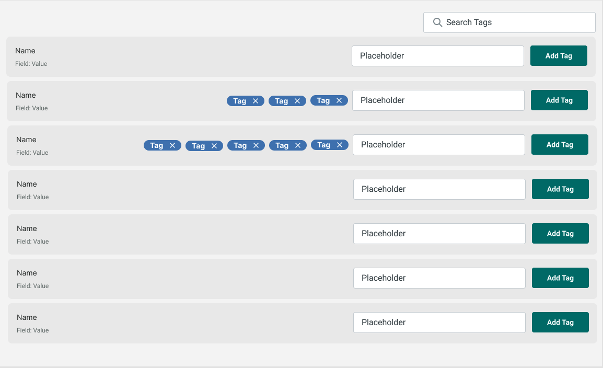

# Tag Manager App

> A Typescript/Sass React project

## Specifications

- Each Item should display Name and Date.
- A user must be able to add tags to each item
- An item can have a max of 5 tags
- Each tag can be removed
- The list of items should be filterable by a tag search
- It should use custom components and styles

## Assumptions

- Use a state management that best fits this app
- Set app state in a way that tagging and filtering become constants ops
- Code should be written in typescript
- Styles should use pure SASS
- Can use components previously made by myself?

## Further improvements

- Add pagination
- Persist to a real Database
- Start filtering to the closest match when user types 3 chars
- Add key listener on "Enter key" for all input fields
- Improve responsive design
- Add a library to parse date in a friendly manner

> UI Design

> by SEDNA
